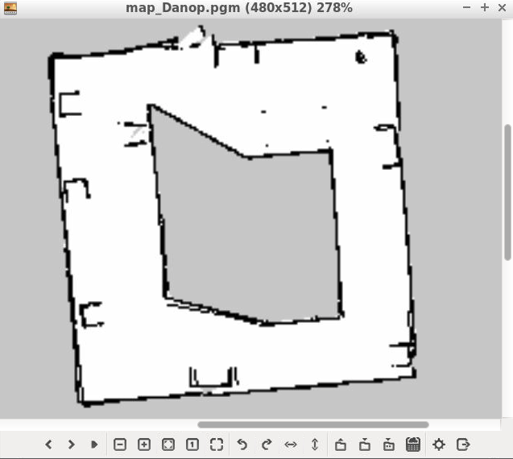
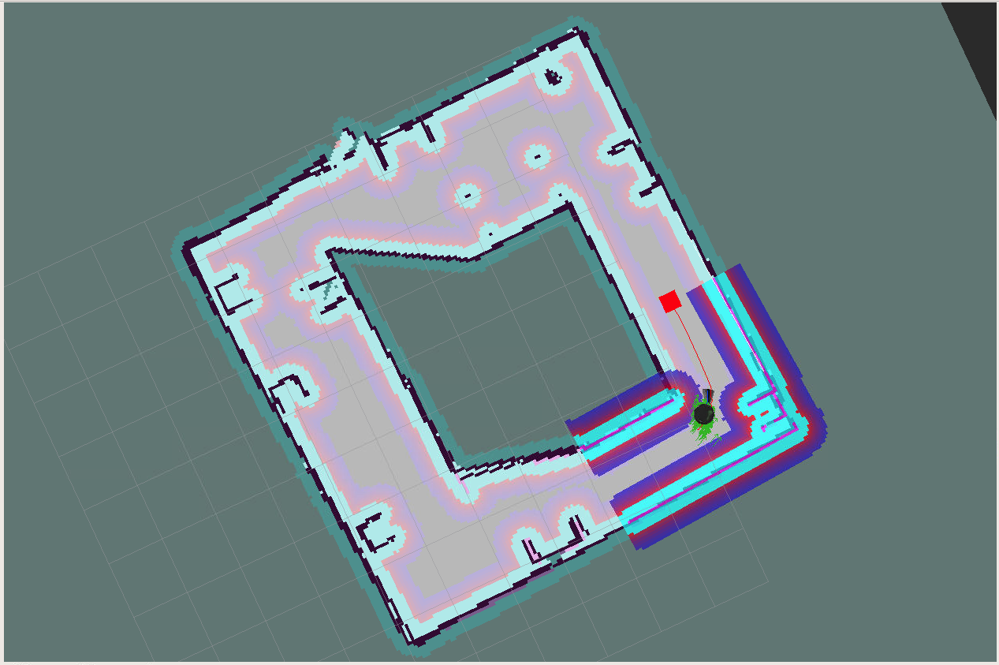

# Home Service Robot
This project is the final project, part of Udacity Robotic Software Engineer Nanodegree.

## Project Description
There are five tasks in this project. All the script files to run are in `<This repo>/my_home_service_robot/scripts` folder.

### SLAM Testing
In this task, we use slam_gmapping package to generate a map of our environment. This map will be use for the incomming tasks. `test_slam.sh` is the name of the script file. This script runs gazebo, slam_gmapping, rviz, and teleop. After mapping, the map can be saved using a command
```
rosrun map_server map_saver
```
Below is the screenshot of the generated map.


### Navigation Testing
The map generated from the previous task is used for localization and navigation for this task. `test_navigation.sh` is the name of the script file. The script runs gazebo, amcl, and rviz. We can use rviz to manually send goal location and see how the robot can successfully go there.

### Pick Object
In this task, the pick up and drop off location is specified in c++ code so that the robot can navigate there without using rviz to send goal location. `pick_objects.sh` is the name of the script. The script runs gazebo, amcl, rviz, and pick_objects node.

### Add Marker
In this task, we add a virtual object in rviz to represent the object to be picked and dropped off by the robot. `add_markers.sh` is the name of the script. The script runs gazebo, amcl, rviz, and add_markers node.

### Home Service
This is the last task of this project that combines all the previous tasks above in action. Basically, the robot localizes and navigates through the map in rviz; moves to pick up location and picks up a virtual object, waits 5 seconds; moves to drop off location and drops off the virtual object. `home_service.sh` is the name of the script. The script runs gazebo, amcl, rviz, pick_objects and add_markers_sync_robot node. The difference between add_markers and add_markers_sync_robot node is that the latter synchronizes the display of the virtual object when the robot reaches the pick up or the drop off location. The add_markers does not synchronize the timing.

Below is the screenshot of the roboting running home service.


## Basic Build Instructions
This repo contains slam_gmapping, turtlebot, turtlebot_interactions, and turtlebot_simulator packages for submission per project rublic. Make sure uninstall the old packages in your system before proceeding.

1. Make sure all project dependencies are installed by running
```
rosdep -i install slam_gmapping turtlebot turtlebot_interactions turtlebot_simulator
```
2. Clone and build this repo using catkin_make.
3. cd to my_home_service_robot package.

4. To run each script file in scripts folder,
```
./scripts/test_slam.sh
./scripts/test_navigation.sh
./scripts/pick_objects.sh
./scripts/add_markers.sh
./scripts/home_service.sh
```